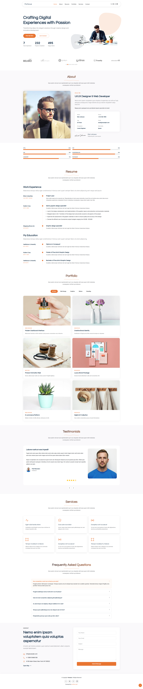

# 🌐 Portavue – HTML5 Bootstrap Portfolio Template

**Portavue** is a sleek, modern, and responsive HTML5 portfolio template built with the power of **Bootstrap 5**. Designed for **developers, designers, freelancers, and creatives**, it provides a clean and professional way to showcase your work and personal brand online.

---

## 🚀 Meaning Behind the Name

**Portavue** is a blend of two ideas:
- **"Porta"** from *portfolio*, representing your professional work.
- **"Vue"** (from French, meaning *view*), symbolizing the clear, visual presentation of your projects.

Together, **Portavue** stands for a **"clear view of your portfolio"** — minimal, elegant, and focused on what matters: **you and your work**.

---

## 🎯 Purpose

The purpose of **Portavue** is to provide:
- ✅ A clean and mobile-friendly portfolio layout.
- ✅ Easy-to-edit HTML/CSS structure for fast customization.
- ✅ Bootstrap-powered responsiveness and grid system.
- ✅ Sections for projects, skills, testimonials, contact, and more.
- ✅ A professional online presence for personal branding.

---

## 📁 Key Features

- 🌟 Fully Responsive (Mobile-First Design)
- 🎨 Modern Aesthetic with Customizable Themes
- 🧱 Bootstrap 5 Framework
- 💬 Contact Form Integration Ready
- ⚡ Optimized for Performance and SEO
- 🧑‍💻 Clean Code & Developer Friendly

---

## 🔧 How to Use

1. Download or clone the repo.
2. Edit the `index.html`, update content, and add your own images.
3. Customize styles via `main.css`.
4. Deploy to GitHub Pages, Netlify, or your own server.

---

## 📸 Live Preview

---

## 👨‍💻 Perfect For:

- Web Developers
- Designers
- Freelancers
- UI/UX Professionals
- Students & Graduates

---

## 📜 License

MIT License — free to use, modify, and distribute.

---

> ✨ **Portavue** – Because your work deserves a beautiful stage.
